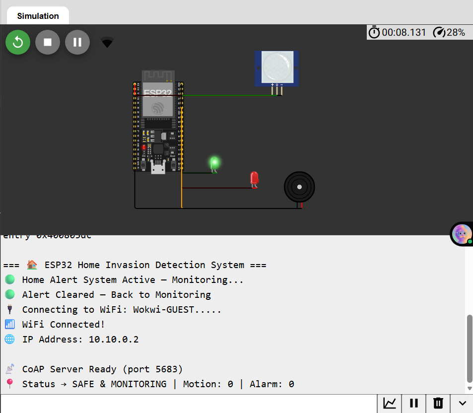
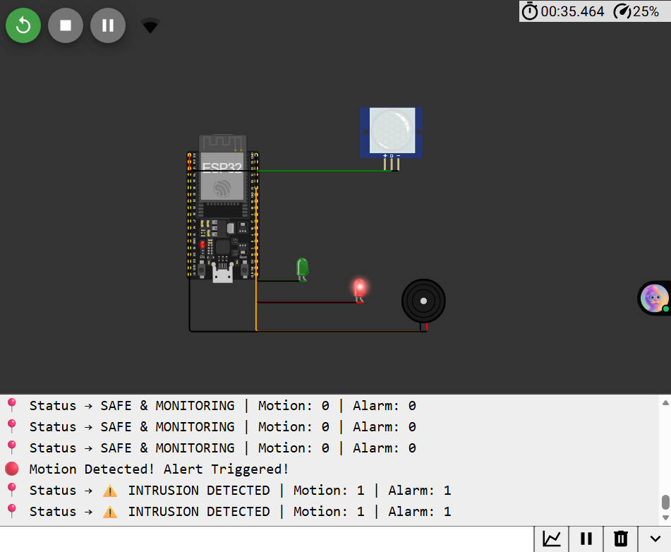
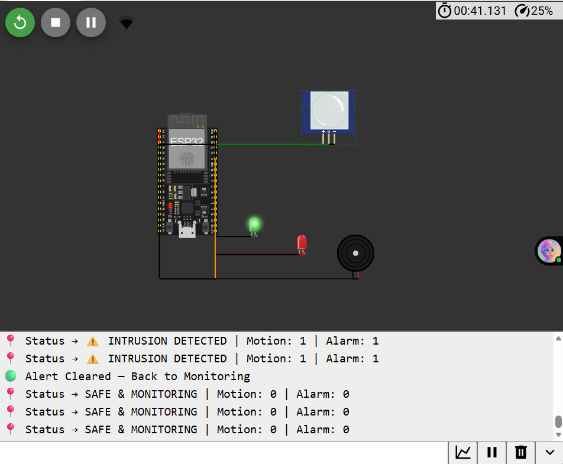

# 🏠🔒 Home Invasion Detection System using ESP32

_Automated Motion-Based Security Alert System (Wokwi Simulation)_

---

## 📌 Project Overview

This project implements a **fully automated home intrusion detection system** using the **ESP32**, **PIR motion sensor**, **LED indicators**, and a **buzzer**.

The goal was to create a system that **detects motion**, **activates an alarm for 5 seconds**, and then **returns to safe monitoring mode automatically** — without requiring any manual commands or external clients.

The entire behaviour is **self-running**, designed specifically to overcome **CoAP IP access limitations in Wokwi**, where external clients cannot reach the ESP32's simulated network.  
Thus, automation ensures the project runs correctly _in any environment_.

---

## 🖼️ Output Screenshots

### 🟢 System Startup (Monitoring Mode)

> 

### 🔴 Motion Detected (Alert Mode)

> 

### 🔄 Auto Reset After 5 Seconds

> 

You can drag images into this section after generating them from Wokwi.

---

## 🤖 How the System Works

### ✔ 1. System Starts → Monitoring Mode

- Green LED ON
- Red LED OFF
- Buzzer OFF
- Status printed every second
- System is automatically **armed**

### ✔ 2. Motion is Detected (PIR → HIGH)

- Green LED turns OFF
- Red LED turns ON
- Buzzer activates
- Message printed:  
  **“🔴 Motion Detected! Alert Triggered!”**
- Alert stays active for **5 seconds**

### ✔ 3. Auto Reset

After 5 seconds:

- Red LED turns OFF
- Buzzer turns OFF
- Green LED turns ON
- System returns to monitoring
- Message printed:  
  **“🟢 Alert Cleared — Back to Monitoring”**

The entire process is **automatic**, requiring no commands, apps, or clients.

---

## 🛠️ Why Automated Instead of Client-Controlled?

Wokwi's simulation environment has **CoAP networking limitations**:

- The ESP32 runs inside Wokwi’s virtual network
- External CoAP clients **cannot access** the simulated ESP32 IP
- Ports like **5683 (CoAP)** are not reachable from outside
- Reverse connections are also blocked

Because of this:

- We cannot send CoAP commands from a laptop
- We cannot run a mobile app or Postman against the ESP32
- Manual testing becomes impossible

### ✅ Solution: Make the system **fully automatic**

We redesigned the system so that:

- No user interaction is required
- No external client is needed
- The system reacts **only to sensor input**
- Everything is handled on the ESP32 itself

This ensures the project works perfectly on:

- Wokwi
- Real ESP32 hardware
- Any restricted environment

---

## 🧩 Code Structure (Explanation of all the Sections)

### 🔹 1. System State Structure

Stores:

- Whether the system is armed
- Motion detection status
- Whether alarm is active
- Start time of alert
- Human-readable status text

This helps keep the entire logic clean and centralized.

---

### 🔹 2. Monitoring Mode Function

Turns:

- Green LED → ON
- Red LED → OFF
- Buzzer → OFF  
  Sets status to **SAFE & MONITORING**.  
  Called at startup and after alert ends.

---

### 🔹 3. Alert Mode Function

Triggered on motion detection:

- Turns Green LED OFF
- Turns Red LED ON
- Activates buzzer
- Records alert timestamp  
  Used to keep the alert active for exactly **5 seconds**.

---

### 🔹 4. Motion Checking Loop

Runs multiple times per second:

- Reads PIR state
- Activates alert if motion is detected
- Auto-clears alert after 5 seconds
- Prints system status every second

---

### 🔹 5. CoAP Endpoints (Optional)

Even though automation handles everything internally, CoAP endpoints are included for:

- `/status` → Read system state
- `/arm` → Turn system ON/OFF
- `/reset` → Manual reset

These are optional and not required for the system to function.

---
